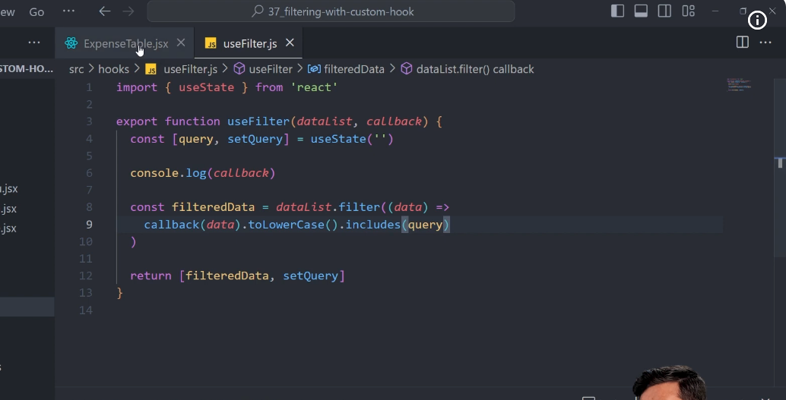
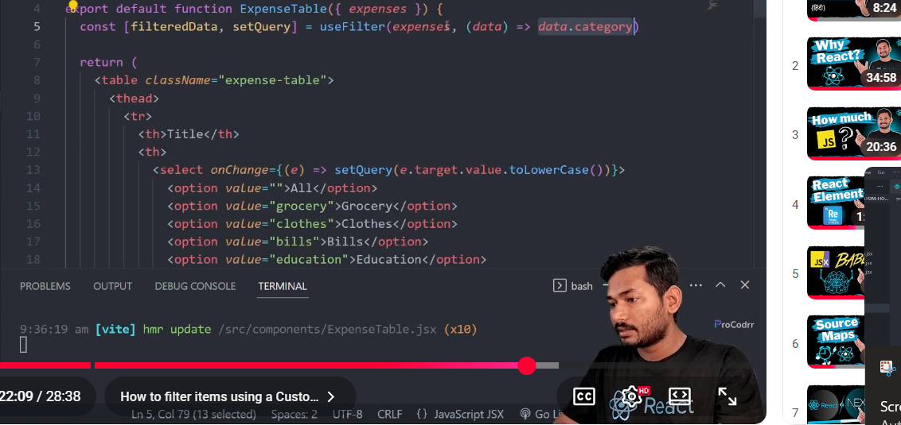

<!-- control inputs, 1 way data binding(uni directional data flow) -->
1. ager emna koi statr h title ok usko set kra h starting m book value k ok or fr ek input m value m title dya h to fr hm kitna bhi try kr lai type krna k input filed k thorue from web kuch refelect n hoga ok
2. javascript masa n we chane it by typing but react hmko rok tha h, per hm asa kuch same implemnt kr skta h by suing our js as well ok 
3. asa jabhi krta h jab hm input m value att k use krta h ok 
4. 1 way data binding vs 2 way data binding 
41. react ek 1 way data binding mtlb ki 
42. vue/angular.js yha 2 way data binding per kam krti h means ki - hmko yha btana hota ki change krna per state update kro or fr re-render balki input m jis value(state/property) s attached h bas input m liko or wo autmoaticlly update hojta h ider koi asa seen n hi ki phla onchange s hi wo update hoga means update khus s krna hta h react, 1 way m per 2 way n krna hota hko khud s 
43. react m asa h ki jab data update hoga jab hi ui update hoga per ui hmra data ko update n krta h like angular,veu
44. ui means dom , input filed ok like
45. sceen update k lya phla data k update hona must h react , 1 way daya binding per , screen update s data k updatw anguar veu m hota h jo ki 2 way data binding per ka m krta h
5. 1 way data binding tha concepts use krka hm controlled input filed create krta h ok - mtlb ki wo input filed jo control h state s , bc state update hona per hi ui update hoga isslya
6. ok clear h ki khud s manully updste krta h by using onChange , in which we use setState fun and pass a 
<!-- event.target.value -->
7. 2 trika s hm log implment kr skta h ab controlled input mtlb ki ek to ki form  4 input filed h to sabka lya alg alg sgtate create krka update krna ya fr 2nd ki ek object k use krka krna ab wo dekna h 

